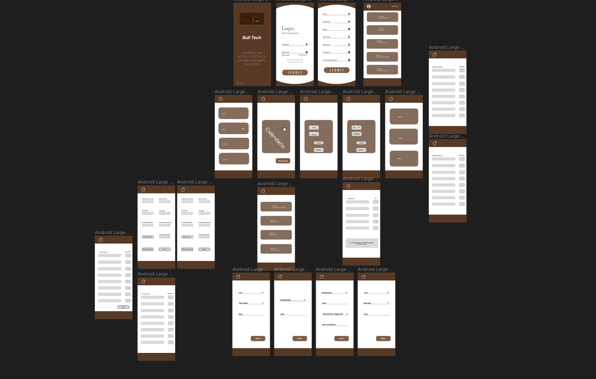

# Aplicativo Mobile para Gerenciamento de Bovinos em Propriedades Rurais

## (O SISTEMA COMPLETO ENCONTRA-SE NA BRANCH MASTER)

## Descrição
Este projeto visa desenvolver um aplicativo móvel para auxiliar proprietários rurais no gerenciamento eficiente de seus rebanhos bovinos e no controle financeiro de suas atividades pecuárias. O aplicativo terá funcionalidades intuitivas e abrangentes, visando facilitar a rotina de gestão das propriedades e aumentar a produtividade e lucratividade dos produtores.
## Funcionalidades
* ### Gerenciamento de Rebanho
O aplicativo permitirá o cadastro e controle detalhado dos lotes de bovinos, incluindo informações como identificação, valores, peso, histórico de vacinações, reprodução, entre outros.

* ### Calendário de Eventos
Uma funcionalidade de calendário permitirá aos usuários acompanhar e programar eventos importantes, como vacinações, partos, vendas, entre outros, com notificações para não perder prazos.

* ### Conversão de Peso
O aplicativo contará com uma ferramenta de conversão de peso, que converterá automaticamente o peso dos animais, facilitando o acompanhamento do desenvolvimento do rebanho.

* #### Calculadora de Rações
Uma calculadora de rações permitirá aos usuários determinar a quantidade ideal de alimento a ser fornecida aos animais, levando em consideração o tipo de ração e o tamanho do rebanho.

* #### Controle Financeiro
 O aplicativo terá um módulo de controle financeiro, no qual os produtores poderão registrar suas receitas e despesas relacionadas à atividade pecuária, gerando relatórios e análises para uma melhor tomada de decisão.

## Benefícios Esperados
* Melhoria na gestão do rebanho, com maior controle e acompanhamento das informações zootécnicas.
* Otimização da alimentação e nutrição dos animais, com a calculadora de rações.
* Melhor planejamento e controle das atividades e eventos da propriedade, com o calendário integrado.
* Aprimoramento do controle financeiro, facilitando a análise de custos e receitas.
* Aumento da produtividade e lucratividade da atividade pecuária.

## Público-Alvo
O aplicativo será desenvolvido para atender principalmente pequenos e médios produtores rurais, que buscam ferramentas de gestão eficientes e de fácil utilização para melhorar o desempenho de suas atividades pecuárias.
Tecnologias Utilizadas
O aplicativo será desenvolvido utilizando tecnologias móveis, como Java ou Kotlin, e uma base de dados para armazenar as informações dos bovinos e das operações financeiras. Será implementado em um servidor para que os usuários possam acessá-lo em qualquer lugar e a qualquer momento.
## Próximos Passos
Após a definição das funcionalidades e da arquitetura do aplicativo, será realizada uma fase de testes com um grupo de produtores rurais para obter feedback e realizar os ajustes necessários antes da versão final. Em seguida, o aplicativo será implementado e disponibilizado para uso dos produtores.

## Tecnologias Utilizadas

  * Linguagem de programação: TypeScript
  * Framework/biblioteca: React Native
  * Banco de dados: Supabase

## Protótipo

link do prototipo no figma
[Prototipo](https://www.figma.com/file/xTPbfypmyDpxrZLTi7QZNs/BullTech-Phone?type=design&node-id=0%3A1&mode=design&t=ECMXuzdukrnFKLJX-1)

## Licença
Este projeto está licenciado sob a Licença MIT.
## Contato
Para mais informações ou suporte, entre em contato com Karla Ferreira pelo e-mail kferreira_@outlook.com.
