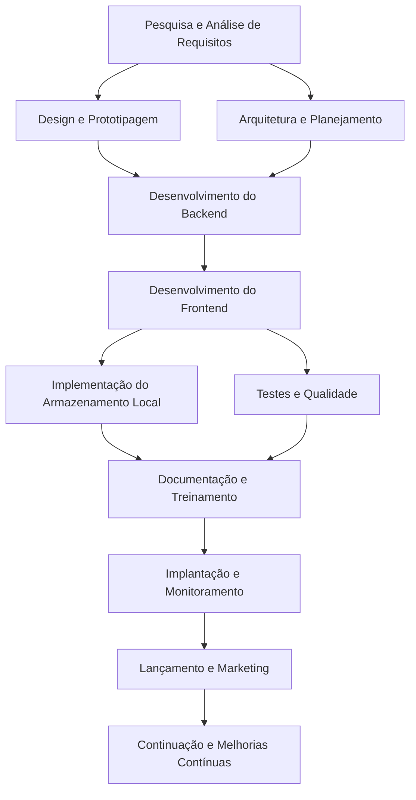

# seguindo orientação do github:
Como seu orientador, vou guiá-lo através do processo de criação de um projeto React Native TypeScript bem estruturado para gerência de propriedades, utilizando bancos de dados remotos e locais. Aqui está uma orientação passo a passo:

### 1. Escolha das Tecnologias

Para este projeto, recomendo:

Frontend:
- React Native TypeScript
- React Navigation para navegação
- React Native Reanimated para animações suaves

Backend:
- Node.js com Express
- MongoDB como banco de dados remoto

Armazenamento local:
- IndexedDB para dados persistentes no dispositivo
- AsyncStorage para dados temporários

### 2. Estrutura do Projeto

```
gerenciaBov/
├── frontend/
│   ├── src/
│   │   ├── components/
│   │   ├── screens/
│   │   ├── services/
│   │   ├── models/
│   │   └── App.tsx
│   ├── assets/
│   ├── hooks/
│   ├── utils/
│   └── index.js
├── backend/
│   ├── src/
│   │   ├── controllers/
│   │   ├── models/
│   │   ├── routes/
│   │   └── app.js
│   ├── package.json
│   └── tsconfig.json
├── database/
│   ├── remote/
│   │   └── schema.js
│   └── local/
│       └── schema.js
└── README.md
```

### 3. Implementação do Backend

1. Crie um projeto Node.js com Express
2. Configure o MongoDB como banco de dados remoto
3. Implemente endpoints RESTful para CRUD operations
4. Utilize middlewares para validação e autenticação

### 4. Implementação do Frontend

1. Crie um novo projeto React Native com TypeScript
2. Organize os componentes em pastas lógicas (forms, lists, views)
3. Implemente o navegação usando React Navigation
4. Crie hooks personalizados para interagir com o backend e o armazenamento local

### 5. Implementação do Armazenamento Local

1. Use IndexedDB para dados persistentes (ex: histórico de operações)
2. Utilize AsyncStorage para dados temporários (ex: estado do formulário)

### 6. Implementação da Sincronização Offline/Online

1. Crie um serviço que monitora a conectividade
2. Implemente uma lógica de fallback para operações offline
3. Quando online novamente, sincronize os dados com o backend

### 7. Segurança e Autenticação

1. Implemente JWT para autenticação
2. Use HTTPS para todas as comunicações com o backend
3. Valide todos os dados de entrada no backend

### 8. Testes e Qualidade de Código

1. Implemente testes unitários e de integração
2. Use ESLint e Prettier para manter a qualidade do código
3. Implemente CI/CD para automação de builds e testes

### 9. Documentação e Deploy

1. Crie documentação detalhada do API RESTful
2. Implemente um sistema de logging robusto
3. Prepare o projeto para deploy em ambientes de produção

### Recomendações de Bancos de Dados

Remoto:
- Firebase/Firestore: Fácil de implementar, boa documentação e suporte à sincronização offline
- MongoDB Atlas: Flexível e escalável, ideal para aplicações móveis

Local:
- IndexedDB: Bom para dados persistentes, suportado nativamente pelo navegador
- SQLite: Excelente para aplicações móveis, mas requer biblioteca adicional

### Sugestões Adicionais

1. Implemente um sistema de cache para melhorar a performance
2. Considere usar Redux para gerenciar o estado complexo
3. Adicione internacionalização para expandir o alcance do aplicativo
4. Implemente um sistema de notificações push para atualizações importantes

Lembre-se de seguir as melhores práticas de segurança e privacidade ao trabalhar com dados sensíveis. Esteja sempre atualizado com as últimas versões das bibliotecas e frameworks que você estiver usando. Boa sorte com seu projeto!

Citations:
[1] https://stackoverflow.com/questions/64974265/recommended-firebase-data-structure-for-my-react-native-app
[2] https://rxdb.info/react-native-database.html
[3] https://rnfirebase.io/typescript
[4] https://medium.com/@akshit5230/react-native-typescript-structuring-your-project-files-ca243ea216e9
[5] https://firebase.google.com/docs/firestore/manage-data/enable-offline
[6] https://dev.to/sahilverma_dev/firebase-with-react-and-typescript-a-comprehensive-guide-3fn5
[7] https://www.excellentwebworld.com/react-native-database/
[8] https://firebase.google.com/support/release-notes/js
[9] https://github.com/invertase/react-native-firebase/discussions/5594
[10] https://itchronicles.com/mobile/top-local-databases-for-react-native-app-development/


Como seu orientador, vou continuar o raciocínio e entrar em detalhes sobre cada passo, incluindo um diagrama de fluxo para o projeto completo. Vamos partir do início até a finalização da venda de produto.

### 1. Pesquisa e Análise de Requisitos

1. Realize uma pesquisa de mercado para identificar as necessidades específicas do público-alvo.
2. Crie um questionário de survey para coletar informações detalhadas sobre as preferências dos usuários.
3. Analise os resultados da pesquisa e organize os requisitos do projeto.
4. Crie um documento de requisitos técnicos detalhado.

### 2. Planejamento e Arquitetura

1. Desenvolva um diagrama de classes para modelar a estrutura do aplicativo.
2. Crie um diagrama de fluxo geral do sistema.
3. Elabore um plano de teste detalhado.
4. Estabeleça metas de desempenho e métricas de sucesso.

### 3. Design e Prototipagem

1. Desenvolva wireframes básicos das telas principais.
2. Crie protótipos interativos para testar a experiência do usuário.
3. Refine o design visual e a usabilidade das interfaces.
4. Obtenha feedback dos potenciais usuários e faça ajustes.

### 4. Desenvolvimento do Backend

1. Escolha e configure o ambiente de hospedagem para o backend (ex: Heroku, DigitalOcean).
2. Implemente a infraestrutura necessária (ex: banco de dados, servidores).
3. Desenvolva os endpoints RESTful para as operações CRUD.
4. Implemente autenticação e autorização robustas.
5. Adicione middlewares para logging e monitoramento.

### 5. Desenvolvimento do Frontend

1. Configure o ambiente de desenvolvimento React Native.
2. Crie uma estrutura básica do projeto com componentes reutilizáveis.
3. Implemente a navegação entre telas usando React Navigation.
4. Desenvolva componentes para cada funcionalidade principal (ex: cadastro de produtos, gerenciamento de estoque).
5. Integre o backend com o frontend através da API RESTful.

### 6. Implementação do Armazenamento Local

1. Configure IndexedDB para armazenamento persistente.
2. Implemente um sistema de cache para melhorar a performance.
3. Desenvolva hooks personalizados para interagir com o armazenamento local.
4. Implemente sincronização offline/online automática.

### 7. Testes e Qualidade

1. Desenvolva testes unitários para componentes e funções individuais.
2. Implemente testes de integração para verificar a comunicação entre componentes.
3. Realize testes de usabilidade com usuários reais.
4. Execute testes de performance em diferentes dispositivos.
5. Realize testes de segurança para identificar vulnerabilidades.

### 8. Documentação e Treinamento

1. Crie documentação técnica detalhada sobre a API RESTful.
2. Desenvolva guias de usuário e tutoriais.
3. Prepare materiais de treinamento para equipes internas ou parceiros.
4. Crie um glossário de termos técnicos utilizados no aplicativo.

### 9. Implantação e Monitoramento

1. Configurar o ambiente de produção.
2. Implementar sistemas de logging e monitoramento.
3. Configurar alertas e notificações automáticas.
4. Realizar teste final de carga antes da liberação.
5. Preparar planos de backup e recuperação de dados.

### 10. Lançamento e Marketing

1. Planejar estratégia de marketing para o lançamento.
2. Criar campanhas publicitárias online e offline.
3. Organizar eventos de lançamento se necessário.
4. Gerenciar expectativas dos usuários antecipadamente.
5. Estabelecer canais de comunicação com a comunidade de usuários.

### Diagrama de Fluxo Geral

Aqui está um diagrama de fluxo simplificado das principais etapas do projeto:



Este diagrama mostra como as diferentes fases do projeto se relacionam e dependem uma da outra. É importante notar que este é um processo iterativo, onde às vezes você pode voltar a etapas anteriores baseado nos resultados obtidos.

Para concluir o projeto até a venda de produto, siga estes passos adicionais:

11. Integração com Sistemas Externos:
   - Implemente integrações com serviços de pagamento (ex: Stripe, PayPal).
   - Considere integrações com sistemas de estoque físico ou plataformas de e-commerce.

12. Otimização e Melhorias Contínuas:
   - Monitore métricas de desempenho e usuários ativos.
   - Cole feedback contínuo dos usuários.
   - Implemente atualizações regulares com novas funcionalidades e correções de bugs.

13. Expansão e Internacionalização:
   - Planeje a expansão para novos mercados.
   - Traduza o aplicativo para múltiplos idiomas.
   - Ajuste a monetização conforme necessário.

14. Suporte e Manutenção:
   - Implemente um sistema de suporte eficiente.
   - Mantenha-se atualizado com as últimas tendências tecnológicas relevantes.
   - Esteja preparado para lidar com problemas de escalabilidade à medida

Citations:
